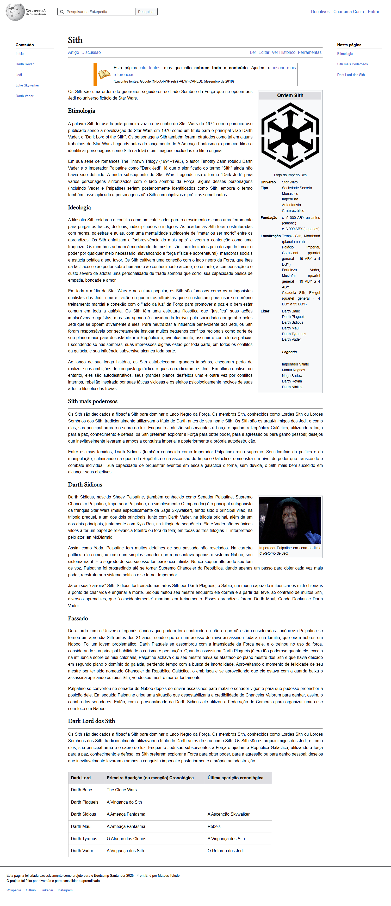

# projeto-wikipedia

Projeto realizado como desafio no Bootcamp Santander 2025 - Front End

Tentei clonar/recriar uma página da Wikipedia do zero apenas observando. Utilizei flex box e grid layout para adaptar as sections do site.

Escolhi um tema que gosto muito, no caso o universo de star wars.

Outro detalhe importante é que alterei o layout, colocando temas relacionados na coluna 1, e o índice na coluna 3.

## Translate

I tried to clone/recreate a Wikipedia page from scratch just by observing it. I used flexbox and grid layout to adapt the site's sections.

I chose a topic I really like, in this case, the Star Wars universe.

Another important detail is that I altered the layout, placing related topics in column 1, and the index in column 3.

## Access Here

<a href="https://pt.wikipedia.org/wiki/Sith" target=_blank>Visit the original site</a>

<a href="https://mttoledo.github.io/projeto-wikipedia/" target=_blank>Visit my project</a>

## Screenshots

  

